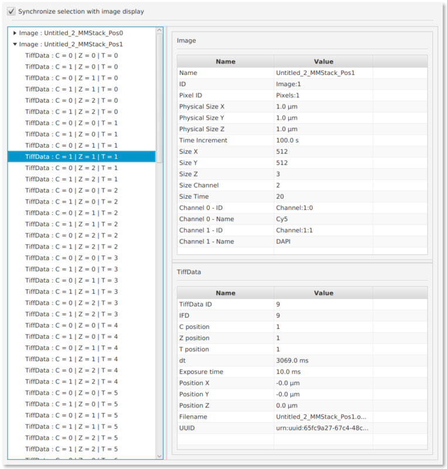

# OMEVisual

`OMEVisual` is a Fiji plugin to easily visualize OME metadata.

See also the Wiki page : http://imagej.net/OMEVisual

Please note that :

- This goal of this plugin is **not to implement** all the OME features.
- This plugin makes several strong assumptions about the OME model in order to simplify the interface :
    - Each image contains only one `Pixels` element.
    - Each `TiffData` contains only one `Plane`.
    - `Plane` and `TiffData` informations are displayed at the same location without distinction.
- Any ideas to improve the visualization and/or add OME features is very welcome :
    - The best way is to submit a PR.
    - You can also open an issue and post an OME-TIFF file which contains additional OME features you would like to see added to the plugin.

The plugin has been tested on the following OME sample dataset http://downloads.openmicroscopy.org/images/OME-TIFF/2015-01/bioformats-artificial/multi-channel-4D-series.ome.tif and with an OME TIFF file generated by Micro-Manager.

## How to use

- Open your image in Fiji.
- Start the plugin with `Plugins ► Utilities ► Visualize OME Metadata`.
- A window should open with the metadata in it.

## Authors

`OMEVisual` has been created by [Hadrien Mary](mailto:hadrien.mary@gmail.com).

This work started in 2016 at the [Gary Brouhard laboratory](http://brouhardlab.mcgill.ca/) at the University of McGill.

## License

MIT. See [LICENSE.txt](LICENSE.txt)
